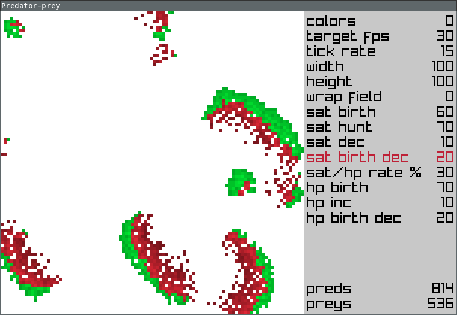
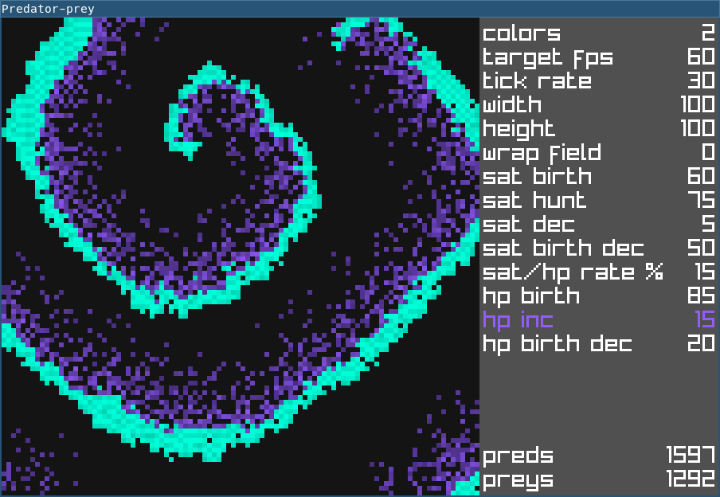

# Predator-prey simulation

A simple 2D simulation written in C using raylib.

## Rules

Preys feed from the ground and reproduce.
Predators eat preys to keep living and can reproduce when satiated.
Movement is life: every entity tries to move at every tick of the timer
and dies if it can't.

More explicitly, at every tick:
- prey feeds (increase health)
- prey moves to a neighbouring cell
- prey reproduces on enough health: leave their offspring in
original cell and loose some health for giving birth
- prey dies if it couldn't move
- pred hunts when not too satiated: kill prey in one of neighbouring cells
and move there. Increase satiation by prey's health multiplied by a
conversion rate
- pred moves if can't hunt: move to a neighbouring cell
- pred reproduces on enough satiety: leave their offspring in
original cell and loose some satiety for giving birth
- pred dies if it couldn't move

## Controls

- pause (space, p)
- clear field (del)
- exit (esc)
- add mode (a):
  - add pred (lmb)
  - add prey (rmb)
- del mode (d):
  - del (lmb, rmb)
- increase settings value (right arrow, mouse wheel up)
- decrease settings value (left arrow, mouse wheel down)
